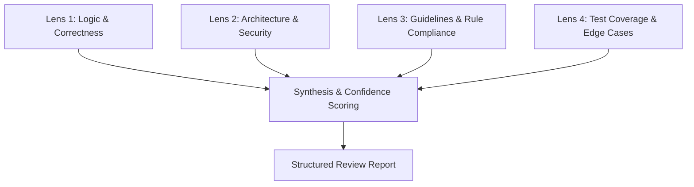

# Code Review Workflow

This skill provides a multi-lens code review methodology for Antigravity IDE. It evaluates code changes systematically to identify critical bugs, security vulnerabilities, architectural inconsistencies, and test gaps, while filtering out subjective noise.

---

## 🔍 The 4-Lens Review Framework



---

### Lens 1: Logic, Concurrency & Correctness
- **State & Invariants**: Are data structures mutated correctly? Are state transitions atomic and idempotent?
- **Async & Concurrency**: Check for unawaited coroutines, race conditions, socket leaks, unclosed streams, and deadlocks.
- **Nullability & Boundaries**: Inspect `None` / `null` handling, off-by-one errors, empty collection access, and type mismatches.
- **Error Propagation**: Ensure exceptions are caught specifically (no blind `except Exception:` unless explicitly required).

---

### Lens 2: Architecture, Security & Performance
- **API & Protocol Contracts**: Verify that JSON-RPC / MCP schemas match across frontend, client manager, and backend engines.
- **Security & Sandboxing**:
  - Check for path traversal vulnerabilities (e.g. `res://` path sanitization).
  - Verify process execution safety (`subprocess.Popen` arguments without `shell=True`).
- **Resource Management**: Confirm that open file descriptors, WebSocket connections, RID handles, and child processes are cleaned up reliably in `finally` blocks.
- **Performance & Latency**: Inspect O(N^2) loops, unnecessary disk I/O, or redundant network roundtrips.

---

### Lens 3: Project Guidelines & Rule Compliance
- **User Rules (`GEMINI.md` / `user_rules`)**:
  - Test framework: `pytest`
  - Environment manager: `uv`
  - Python linting & formatting: `ruff check` / `ruff format`
  - Python type checking: `ty check`
  - JavaScript / Web tooling: `Biome`
  - **No emojis in codebase or assistant responses**
- **Documentation Integrity**: Ensure existing docstrings, type annotations, and comments are preserved.

---

### Lens 4: Test Coverage & Verification Quality
- **Unit & Integration Test Coverage**: Does every new feature or bugfix have corresponding tests in `tests/`?
- **Mock vs. Real Runtime Testing**: Are mock objects updated with new abstract methods? Are integration tests verifying real execution?
- **Negative & Failure Cases**: Are invalid inputs, disconnected sockets, and compilation errors tested?

---

## 📊 Finding Classification & Confidence Scoring

Every finding must include a **Confidence Score (1-10)** and a **Severity Tier**:

| Tier | Description | Action Required |
|---|---|---|
| 🚨 **CRITICAL (Blocker)** | Logic bug, crash, security vulnerability, data loss, or broken API contract. | Must be fixed before merge. |
| ⚠️ **WARNING (Needs Improvement)** | Suboptimal performance, missing error handling, unclosed resources, or rule non-compliance. | Should be addressed. |
| 💡 **SUGGESTION (Nit)** | Refactoring opportunity, naming clarity, or documentation improvement. | Optional improvement. |

---

## 📝 Review Report Structure

When performing a code review, output findings in this clear, actionable structure:

```markdown
## Code Review Summary

- **Status**: [APPROVED | CHANGES REQUESTED | COMMENT]
- **Files Reviewed**: [List of file links]
- **Overall Assessment**: [1-2 sentences summarizing change quality]

---

### Findings

#### [CRITICAL | WARNING | SUGGESTION] Finding Title
- **Location**: [filename.py:L10-L25](file:///path/to/filename.py#L10-L25)
- **Confidence**: [1-10]/10
- **Issue**: Clear explanation of what is wrong and why it is a problem.
- **Proposed Fix**:
```diff
- problematic_line()
+ corrected_line()
```
```

---

## 🛠️ Review Execution Checklist

1. Run `git status` / `git diff` or inspect target files with `view_file`.
2. Evaluate against all 4 lenses.
3. Run the project verification suite to validate test passage:
   ```bash
   uv run ruff check && uv run ty check && uv run pytest
   ```
4. Generate the structured review report with clickable file links and exact diffs.
