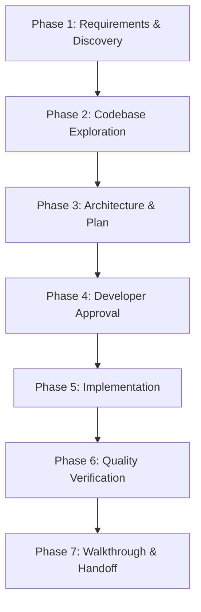

# Feature Development Workflow

This skill provides a rigorous, 7-phase engineering workflow for developing new features and complex architectural changes within Antigravity IDE. It prevents hallucinations, ensures alignment with existing codebase patterns, and delivers clean, verified code.

---

## 🚀 The 7-Phase Feature Development Lifecycle



---

### Phase 1: Requirements & Discovery
**Goal**: Establish unambiguous clarity on functional requirements, constraints, and success criteria.

1. **Clarify Ambiguity**:
   - Identify edge cases, target platforms, protocol constraints, and performance requirements.
   - Do NOT make silent assumptions about business logic or breaking API changes.
2. **Review Knowledge Items (KIs) & Project Rules**:
   - Check `<appDataDir>/knowledge` and project rules (`GEMINI.md` / `.agents/rules/`).
   - Identify established libraries, tools, and coding guidelines (e.g. `pytest`, `uv`, `ruff`, `ty`).

---

### Phase 2: Codebase Exploration & Pattern Mapping
**Goal**: Locate all affected subsystems, existing conventions, and extension points.

1. **Search & Trace Existing Patterns**:
   - Use `grep_search` and `view_file` to inspect similar components, base classes, and test suites.
   - Map dependencies: check models, protocol schemas, client dispatchers, and tool registries.
2. **Identify Impact Radius**:
   - List every file that will be created, modified, or deprecated.
   - Verify backwards compatibility constraints with existing tools, RPCs, or CLI commands.

---

### Phase 3: Architectural Design & Implementation Plan
**Goal**: Formulate a structured design document before writing production code.

1. **Create or Update `implementation_plan.md`**:
   - Document:
     - Feature Overview and User Goals
     - Architectural Changes & Data Flow
     - Component File Inventory (`[NEW]`, `[MODIFY]`, `[DELETE]`)
     - Open Questions & User Decisions
     - Verification Plan (Automated & Manual tests)
2. **Set Artifact Metadata**:
   - Set `UserFacing: true` and `RequestFeedback: true` on the implementation plan.

---

### Phase 4: Developer Alignment & Plan Approval
**Goal**: Ensure the user approves the technical design before execution begins.

1. **Stop and Present Plan**:
   - Summarize key design decisions and open questions in the chat response.
   - Stop tool execution to allow the developer to review, approve, or adjust the plan.
2. **Incorporate Feedback**:
   - If changes are requested, refine `implementation_plan.md` and re-align before modifying source files.

---

### Phase 5: Structured Incremental Implementation
**Goal**: Execute code modifications adhering strictly to project guidelines.

1. **Bottom-Up Construction**:
   - **Data Models & Schemas**: Define Pydantic / Zod types first.
   - **Core Engine / Backend Logic**: Implement operations, dispatchers, and helpers.
   - **Client & Tool Registrations**: Expose tools, CLI commands, and formatters.
2. **Coding Discipline**:
   - Maintain documentation integrity; preserve existing docstrings and comments.
   - Use precise file editing tools (`replace_file_content` / `multi_replace_file_content`).
   - Strictly follow project rules: Python 3.14+, `uv`, `pytest`, `ruff`, `ty`, avoid emojis.

---

### Phase 6: Quality Review & Automated Verification
**Goal**: Validate correctness, prevent regressions, and enforce zero lint/type errors.

1. **Run Automated Test Suite**:
   - Run unit tests and integration tests:
     ```bash
     uv run pytest
     ```
2. **Static Typing & Linting**:
   - Run type checker and formatters:
     ```bash
     uv run ruff check --fix && uv run ruff format && uv run ty check
     ```
3. **Live Engine / Runtime Validation**:
   - Test against running backend instances or live integration targets to confirm end-to-end functionality.

---

### Phase 7: Walkthrough & Handoff
**Goal**: Document the completed work with clear verification evidence.

1. **Update `walkthrough.md`**:
   - Document changes made, test commands executed, and output snippets.
   - Highlight any follow-up tasks, configuration options, or migration steps.
2. **Deliver Concise Response**:
   - Provide clickable file links using `file:///path/to/file` markdown syntax.
   - Point the developer to the walkthrough artifact for details.
